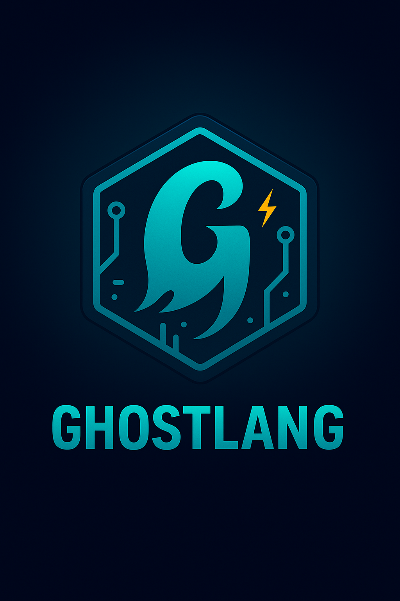

# Ghostlang Language Server (ghostls)

<div align="center">
  

**Native Zig Language Server for the Ghostlang Ecosystem**


</div>

---

## 🌐 Overview

**ghostls** is the official **Language Server** for **Ghostlang**, built in **Zig** for speed, predictability, and tight integration with the Ghost ecosystem.

It provides rich editor features — syntax highlighting, document symbols, navigation, completions — powered by **Grove** (Tree-sitter engine) and designed to plug seamlessly into **Grim**, **VSCode**, and **Neovim**.

---

## ✨ Core Features

| Category | Description |
|-----------|-------------|
| 🧠 **Tree-sitter Syntax Intelligence** | Powered by Grove for fast, accurate parsing |
| 🧩 **LSP Protocol** | Fully compliant with the Language Server Protocol (LSP v3.17) |
| 💡 **Editor Support** | Works with Grim, VSCode, and Neovim |
| ⚙️ **Incremental Parsing** | Keeps the AST in sync on every keystroke |
| 🧰 **Extensible via Ghostlang Runtime** | Future runtime integration for semantics and type inference |

---

## 🧱 Architecture

      ┌───────────────────────────────┐
      │           Grim IDE            │
      │    (Frontend / Editor UI)     │
      └───────────────┬───────────────┘
                      │  LSP JSON-RPC
                      ▼
      ┌───────────────────────────────┐
      │        ghostls          │
      │  ├── LSP core (protocol.zig)  │
      │  ├── Syntax (via Grove)       │
      │  ├── Diagnostics engine       │
      │  ├── Document manager         │
      │  └── Feature providers        │
      └───────────────┬───────────────┘
                      │
                      ▼
      ┌───────────────────────────────┐
      │        Ghostlang runtime      │
      │  (future: type system, eval)  │
      └───────────────────────────────┘

---

## 🚀 Quick Start

### Build
```bash
zig build -Drelease-safe
```
### Run
```bash
./zig-out/bin/ghostls
```

## 📦 Using ghostls as a Zig dependency

To integrate ghostls into another Zig project (such as an IDE, editor plugin, or tool):

### 1. Fetch the dependency
```bash
zig fetch --save https://github.com/ghostkellz/ghostls/archive/refs/heads/main.tar.gz
```

This will automatically add ghostls to your `build.zig.zon` with the correct hash.

### 2. Import in `build.zig`
```zig
const ghostls = b.dependency("ghostls", .{
    .target = target,
    .optimize = optimize,
});

// Link the library or executable as needed
exe.root_module.addImport("ghostls", ghostls.module("ghostls"));
```
