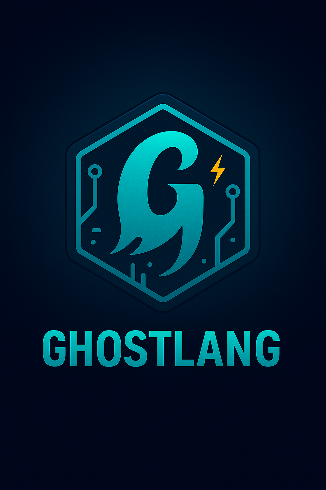

# Ghostlang Language Server (ghostls)

<div align="center">
  

**Native Zig Language Server for the Ghostlang Ecosystem**

<p align="center">
  
  
  
  
</p>

</div>

---

## 🌐 Overview

**ghostls** is the official **Language Server** for **Ghostlang**, built in **Zig** for speed, predictability, and tight integration with the Ghost ecosystem.

It provides rich editor features — syntax highlighting, document symbols, navigation, completions — powered by **Grove** (Tree-sitter engine) and designed to plug seamlessly into **Grim**, **VSCode**, and **Neovim**.

---

## ✨ Core Features

| Category | Description |
|-----------|-------------|
| 🧠 **Tree-sitter Syntax Intelligence** | Powered by Grove for fast, accurate parsing |
| 🧩 **LSP Protocol** | Fully compliant with the Language Server Protocol (LSP v3.17) |
| 💡 **Editor Support** | Works with Grim, VSCode, and Neovim |
| ⚙️ **Incremental Parsing** | Keeps the AST in sync on every keystroke |
| 🧰 **Extensible via Ghostlang Runtime** | Future runtime integration for semantics and type inference |

---

## 🎯 Language Features

### ✅ v0.2.0 - Smart Intelligence

| Feature | Status | Description |
|---------|--------|-------------|
| 🔍 **Find References** | ✅ | Find all symbol usages with `textDocument/references` |
| 🔎 **Workspace Symbols** | ✅ | Project-wide symbol search with fuzzy matching |
| 🧠 **Context-Aware Completions** | ✅ | Smart suggestions based on cursor position and scope |
| 📍 **Go to Definition** | ✅ | Navigate to symbol definitions |
| 📝 **Document Symbols** | ✅ | Outline view of functions and variables |
| 💡 **Hover** | ✅ | Type and documentation on hover |
| 🔴 **Diagnostics** | ✅ | Real-time syntax error detection |
| 📄 **Document Sync** | ✅ | Automatic re-parsing on file changes |

### Context-Aware Completions

ghostls now provides intelligent completions based on your cursor position:

- **After `.`** → Method and property completions
- **Inside functions** → Local variables + built-in functions
- **Top level** → Keywords + global symbols
- **Trigger characters**: `.` and `:`

### Find References

Find all usages of a symbol across your document:

```lua
-- Example: Find all references to `myFunction`
-- Cursor on myFunction → Shows all call sites
local function myFunction() end
myFunction()  -- ← Found
myFunction()  -- ← Found
```

### Workspace Symbol Search

Quick navigation to any symbol in your project:

```
Ctrl+T → Search for "my" → Shows:
  - myVariable (file:///src/main.gza)
  - myFunction (file:///src/utils.gza)
  - myClass (file:///src/models.gza)
```

### ✅ v0.4.0 - GShell Support 🎉

| Feature | Status | Description |
|---------|--------|-------------|
| 🐚 **Shell FFI Completions** | ✅ | Intelligent completions for `shell.*` and `git.*` functions |
| 📂 **File Type Detection** | ✅ | Auto-detect `.gshrc.gza`, `.gshrc`, and `.gsh` files |
| 🔧 **FFI Documentation** | ✅ | Hover documentation for 30+ shell FFI functions |
| 🌍 **Shell Globals** | ✅ | Completions for `SHELL_VERSION`, `HOME`, `PATH`, etc. |
| 📖 **Embedded Definitions** | ✅ | Shell FFI definitions embedded in binary (no external files needed) |

ghostls now provides **full language server support for GShell** - the next-generation shell with Ghostlang scripting!

**Example: Shell FFI Completions**

```lua
-- In ~/.gshrc.gza or *.gsh files
shell.|
      ^ Completions show: alias, setenv, getenv, exec, cd, command_exists, ...

git.|
    ^ Completions show: current_branch, is_dirty, ahead_behind, git_branch, ...

-- Shell global variables
print(SHELL_VERSION)  -- Auto-complete SHELL_VERSION, HOME, PATH, etc.
```

**Supported File Types:**
- `.gshrc.gza` - GShell config with Ghostlang syntax + shell FFI
- `.gshrc` - Traditional shell config (if you use it)
- `.gsh` - GShell script files
- `.gza` - Standard Ghostlang files (no shell FFI)
- `.ghost` - Standard Ghostlang files (no shell FFI)

**Shell FFI Functions (30+):**

**Core Shell:**
- `shell.alias(name, command)` - Create shell alias
- `shell.setenv(key, value)` - Set environment variable
- `shell.getenv(key)` - Get environment variable
- `shell.exec(command)` - Execute command
- `shell.cd(path)` - Change directory
- `shell.command_exists(cmd)` - Check if command in PATH
- `shell.read_file(path)` - Read file contents
- `shell.write_file(path, content)` - Write to file
- `shell.path_exists(path)` - Check if path exists
- `shell.enable_plugin(name)` - Load GShell plugin
- `shell.use_starship(enabled)` - Toggle Starship prompt
- `shell.load_vivid_theme(theme)` - Load LS_COLORS theme
- `shell.get_user()` - Get current username
- `shell.get_hostname()` - Get system hostname
- `shell.get_cwd()` - Get current working directory

**Git Integration:**
- `git.current_branch()` - Get current git branch
- `git.is_dirty()` - Check for uncommitted changes
- `git.ahead_behind()` - Get commits ahead/behind remote
- `git.in_git_repo()` - Check if in git repository
- `git.git_repo_root()` - Get repository root path

**Shell Globals:**
- `SHELL_VERSION` - GShell version string
- `SHELL_PID` - Current shell process ID
- `HOME` - User home directory
- `PWD` - Current working directory
- `PATH` - Executable search path

---

## 🧱 Architecture

      ┌───────────────────────────────┐
      │           Grim IDE            │
      │    (Frontend / Editor UI)     │
      └───────────────┬───────────────┘
                      │  LSP JSON-RPC
                      ▼
      ┌───────────────────────────────┐
      │        ghostls          │
      │  ├── LSP core (protocol.zig)  │
      │  ├── Syntax (via Grove)       │
      │  ├── Diagnostics engine       │
      │  ├── Document manager         │
      │  └── Feature providers        │
      └───────────────┬───────────────┘
                      │
                      ▼
      ┌───────────────────────────────┐
      │        Ghostlang runtime      │
      │  (future: type system, eval)  │
      └───────────────────────────────┘

---

## 🚀 Quick Start

### Install

#### Curl Install (Recommended)
```bash
curl -fsSL https://raw.githubusercontent.com/ghostkellz/ghostls/main/install.sh | bash
```

#### Arch Linux (AUR)
```bash
# Using yay or paru
yay -S ghostls

# Or manually with makepkg
git clone https://github.com/ghostkellz/ghostls.git
cd ghostls
makepkg -si
```

#### Manual Install
```bash
# Clone repository
git clone https://github.com/ghostkellz/ghostls.git
cd ghostls

# Run installer
./install.sh

# Verify installation
ghostls --version  # Should show: ghostls 0.2.0
```

### Build from Source
```bash
zig build -Doptimize=ReleaseSafe
```

### Test
```bash
./run_tests.sh                        # Run full test suite with memory leak detection
./scripts/simple_test.sh              # Run basic LSP protocol test
./tests/grim_integration_test.sh      # Test Grim integration
zig build test                        # Run unit tests directly
```

## 📝 Editor Integration

### Neovim

See [integrations/nvim/README.md](integrations/nvim/README.md) for full setup instructions.

**Quick setup with nvim-lspconfig:**

```lua
require('lspconfig').ghostls.setup{
  cmd = { 'ghostls' },
  filetypes = { 'ghostlang', 'ghost', 'gza' },
}
```

### Grim Editor

**Status**: ✅ ghostls v0.2.0 ready for Grim integration!

ghostls is fully tested and LSP-compliant. Grim can now:
- Auto-spawn ghostls for `.gza` files
- Send LSP requests (hover, definition, completion, references, workspace symbols)
- Receive clean JSON-RPC responses (stdout verified clean)
- Use context-aware completions for better developer experience

See [integrations/grim/README.md](integrations/grim/README.md) for complete implementation guide.

**Quick config example** (`.gza` format):

```ghostlang
-- ~/.config/grim/init.gza
local lsp = require("grim.lsp")

lsp.setup("ghostls", {
    cmd = { "ghostls" },
    filetypes = { "ghostlang", "gza" },
})

register_keymap("n", "gd", ":LspGotoDefinition<CR>")
register_keymap("n", "K", ":LspHover<CR>")
```

📖 **Full integration guide**: [docs/GRIM_INTEGRATION.md](docs/GRIM_INTEGRATION.md)

### VS Code

VS Code extension coming in future releases.

## 📦 Using ghostls as a Zig dependency

To integrate ghostls into another Zig project (such as an IDE, editor plugin, or tool):

### 1. Fetch the dependency
```bash
zig fetch --save https://github.com/ghostkellz/ghostls/archive/refs/heads/main.tar.gz
```

This will automatically add ghostls to your `build.zig.zon` with the correct hash.

### 2. Import in `build.zig`
```zig
const ghostls = b.dependency("ghostls", .{
    .target = target,
    .optimize = optimize,
});

// Link the library or executable as needed
exe.root_module.addImport("ghostls", ghostls.module("ghostls"));
```
